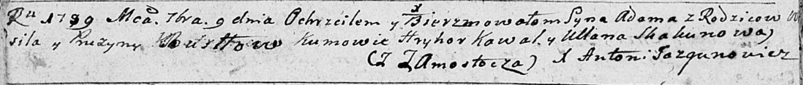

**Бусел Адам Василев (Busłа Adam)**

9 сентября 1789 г -- крещение (НИАБ 136-13-894, лист 7об, №46/1789-р
(ориг)).

**НИАБ 136-13-894:** Лист 7об. **Метрическая запись №46/1789-р (ориг).**

{width="6.496527777777778in"
height="0.6979965004374453in"}

Дедиловичская Покровская церковь. 9 сентября 1789 года. Метрическая
запись о крещении.

Busło Adam -- сын родителей с деревни Замосточье.

Busło Wasil -- отец.

Busłowa Pruzyna -- мать.

Kowal Hryhor - кум.

Skakunowa Ullana - кума.

Jazgunowicz Antoni -- ксёндз.
