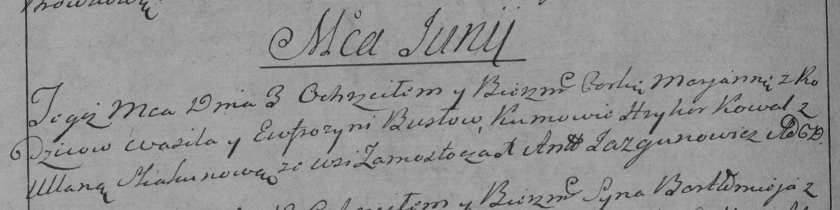

**Бусел Марьяна Василева (Busłowna Marjana)**

3 июня 1792 г -- крещение (НИАБ 136-13-894, лист 16, №32/1792-р (ориг)),
(РГИА 823-2-18, лист 244, №13/1792-р (коп)).

**НИАБ 136-13-894:** Лист 16. **Метрическая запись №32/1792-р (ориг).**

{width="6.496527777777778in"
height="0.9246270778652669in"}

Дедиловичская Покровская церковь. 3 июня 1792 года. Метрическая запись о
крещении.

Busłowna Marjana -- дочь родителей с деревни Замосточье.

Busła Wasil -- отец.

Busłowa Fruzyna -- мать.

Kawal Hryhor - кум.

Skakunowa Ullana - кума.

Jazgunowicz Antoni -- ксёндз.

**РГИА 823-2-18:** Лист 244об. **Метрическая запись №13/1792-р (коп).**

{width="6.496527777777778in"
height="1.6243055555555554in"}

Дедиловичская Покровская церковь. 3 июня 1792 года. Метрическая запись о
крещении.

Busłowna Marjana -- дочь родителей с деревни Замосточье.

Busło Wasil -- отец.

Busłowa Eufrozynia -- мать.

Kowal Hryhor -- кум.

Skakunowa Ullana -- кума.

Jazgunowicz Antoni -- ксёндз.
