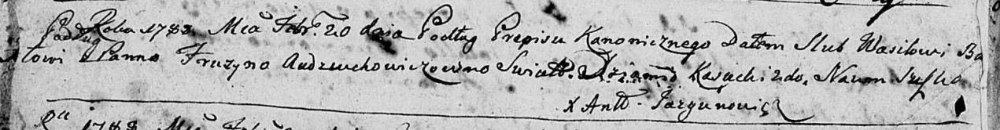
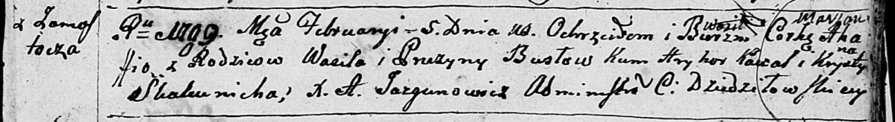

**Бусел (Авдюхович) Прузына (Busłowa Pruzyna, Fruzyna, Eufrosina z
Audziuchowiczow)**

20 февраля 1788 г -- венчание с Василем Буслом (НИАБ 136-13-894, лист
66об, №5/1788-б (ориг)).

9 сентября 1789 г -- крещение сына Адама (НИАБ 136-13-894, лист 7об,
№46/1789-р (ориг)).

3 июня 1792 г -- крещение дочери Марьяны (НИАБ 136-13-894, лист 16,
№32/1792-р (ориг)), (РГИА 823-2-18, лист 244, №13/1792-р (коп)).

1 января 1798 г -- крещение сына Яна (НИАБ 136-13-894, лист 35,
№1/1798-р (ориг)), (РГИА 823-2-18, лист 262, №1/1798-р (коп)).

5 февраля 1799 г -- крещение дочери Агафии Марьяны (НИАБ 136-13-894,
лист 38, №5/1799-р (ориг)), (РГИА 823-2-18, лист 268, №5/1799-р (коп),
НИАБ 136-13-938, лист 240об, №5/1799-р (коп)).

8 ноября 1800 г -- крещение дочери Анны (НИАБ 937-4-32, лист 3,
№36/1800-р (ориг).

**НИАБ 136-13-894:** Лист 66об. **Метрическая запись №5/1788-б (ориг).**

Дедиловичская Покровская церковь. 20 февраля 1788 года. Метрическая
запись о венчании.

Busło Wasil -- жених с деревни \[Замосточье\].

Audziuchowiczowna Fruzyna -- невеста.

Kasucki Dziamid -- свидетель.

Suszko Naum -- свидетель.

Jazgunowicz Antoni -- ксёндз.

**НИАБ 136-13-894:** Лист 7об. **Метрическая запись №46/1789-р (ориг).**

Дедиловичская Покровская церковь. 9 сентября 1789 года. Метрическая
запись о крещении.

Busło Adam -- сын родителей с деревни Замосточье.

Busło Wasil -- отец.

Busłowa Pruzyna -- мать.

Kowal Hryhor - кум.

Skakunowa Ullana - кума.

Jazgunowicz Antoni -- ксёндз.

**НИАБ 136-13-894:** Лист 16. **Метрическая запись №32/1792-р (ориг).**

Дедиловичская Покровская церковь. 3 июня 1792 года. Метрическая запись о
крещении.

Busłowna Marjana -- дочь родителей с деревни Замосточье.

Busła Wasil -- отец.

Busłowa Fruzyna -- мать.

Kawal Hryhor - кум.

Skakunowa Ullana - кума.

Jazgunowicz Antoni -- ксёндз.

**РГИА 823-2-18:** Лист 244об. **Метрическая запись №13/1792-р (коп).**

Дедиловичская Покровская церковь. 3 июня 1792 года. Метрическая запись о
крещении.

Busłowna Marjana -- дочь родителей с деревни Замосточье.

Busło Wasil -- отец.

Busłowa Eufrozynia -- мать.

Kowal Hryhor -- кум.

Skakunowa Ullana -- кума.

Jazgunowicz Antoni -- ксёндз.

**НИАБ 136-13-894:** Лист 35. **Метрическая запись №1/1798-р (ориг).**

Дедиловичская Покровская церковь. 1 января 1798 года. Метрическая запись
о крещении.

Busło Jan -- сын родителей с деревни Замосточье.

Busło Bazyli -- отец.

Busłowa Pruzyna -- мать.

Kawal Hryhor - кум.

Skakunowa Justyna - кума.

Jazgunowicz Antoni -- ксёндз.

**РГИА 823-2-18:** Лист 262. **Метрическая запись №1/1798-р (коп).**

Дедиловичская Покровская церковь. 1 января 1798 года. Метрическая запись
о крещении.

Busła Jan -- сын родителей с деревни Замосточье.

Busła Bazyli -- отец.

Busłowa Pruzyna -- мать.

Kowal Hryhor -- кум.

Skakunowa Justyna -- кума.

Jazgunowicz Antoni -- ксёндз.

**НИАБ 136-13-894:** Лист 38. **Метрическая запись №5/1799-р (ориг).**

Дедиловичская Покровская церковь. 5 февраля 1799 года. Метрическая
запись о крещении.

Busłowna Ahaffia Marjana -- сын родителей с деревни Замосточье.

Busło Wasil -- отец.

Busłowa Pruzyna -- мать.

Kawal Hryhor -- кум.

Skakunicha Krystyna -- кума.

Jazgunowicz Antoni -- ксёндз.

**РГИА 823-2-18:** Лист 268. **Метрическая запись №5/1799-р (коп).**

Дедиловичская Покровская церковь. 5 февраля 1799 года. Метрическая
запись о крещении.

Busłowna Ahafia -- дочь родителей с деревни Замосточье.

Busło Wasil -- отец.

Busłowa Pruzyna -- мать.

Kowal Hryhor -- кум, с деревни Замосточье.

Skakunicha Krystyna -- кума, с деревни Замосточье.

Jazgunowicz Antoni -- ксёндз.

**НИАБ 136-13-938:** Лист 240об. **Метрическая запись №5/1799-р (коп).**

(См. тж. НИАБ 136-13-894, лист 38, №5/1799-р (ориг); РГИА 823-2-18, лист
268, №5/1799-р (коп))

Дедиловичская Покровская церковь. 5 февраля 1799 года. Метрическая
запись о крещении.

Busłowa Ahapa -- дочь родителей с деревни Замосточье.

Busła Wasil -- отец.

Busłowa Pruzyna -- мать.

Kowal Hryhor -- кум, с деревни Осово.

Skakunowa Krystyna - кума.

Jazgunowicz Antoni -- ксёндз.

**НИАБ 937-4-32:** Лист 3. **Метрическая запись №36/1800-р.**

Дедиловичский костел Наисвятейшего Сердца Иисуса. 8 ноября 1800 года.
Метрическая запись о крещении.

Busłowna Anna -- дочь крестьян с деревни Замосточье.

Busła Basili -- отец.

Busłowa Eufrosina -- мать.

Kowal Gregori -- крестный отец, с деревни Замосточье.

Skakunicha Ahapa -- крестная мать, с деревни Замосточье.

Linhart Hyacinthus -- ксёндз.
