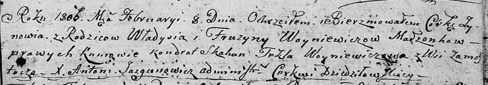

**Войневич Фрузына (Woyniewiczowa Fruzyna)**

8 февраля 1806 г -- крещение дочери Зыновии (НИАБ 136-13-894, лист 59,
№5/1806-р (ориг)).

**НИАБ 136-13-894:** Лист 59. **Метрическая запись №5/1806-р (ориг).**

Дедиловичская Покровская церковь. 8 февраля 1806 года. Метрическая
запись о крещении.

Woyniewiczowna Zynowia -- дочь родителей с деревни Замосточье.

Woyniewicz Władyś -- отец.

Woyniewiczowa Fruzyna -- мать.

Skakun Kondrat -- кум.

Woyniewiczowa Tekla -- кума.

Jazgunowicz Antoni -- ксёндз.
