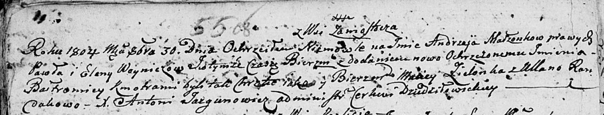

**Войнич Павел (Woynicz Paweł)**

30 октября 1804 г -- крещение сына Андрея Балтромея (НИАБ 136-13-894,
лист 55об, №50/1804-р (ориг)).

**НИАБ 136-13-894:** Лист 55об. **Метрическая запись №50/1804-р
(ориг).**

{width="6.496527777777778in"
height="1.246469816272966in"}

Дедиловичская Покровская церковь. 30 октября 1804 года. Метрическая
запись о крещении.

Woynicz Andrzey Bałtromiey -- сын родителей с деревни Замосточье.

Woynicz Paweł -- отец.

Woyniczowa Elena -- мать.

Zielonka Maciey -- кум.

Randakowa Ullana -- кума.

Jazgunowicz Antoni -- ксёндз.
