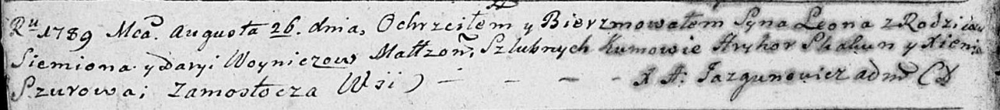
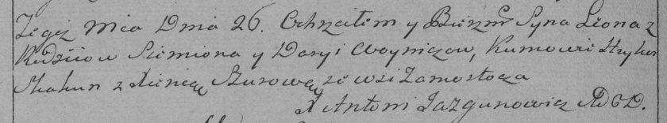

**Войнич Леон Семёнов (Woynicz Leon)**

26 августа 1789 г -- крещение (НИАБ 136-13-894, лист 7об, №40/1789-р
(ориг)), (РГИА 823-2-18, лист 238об, №19/1789-р (коп)).

**НИАБ 136-13-894:** Лист 7об. **Метрическая запись №40/1789-р (ориг).**

Дедиловичская Покровская церковь. 26 августа 1789 года. Метрическая
запись о крещении.

Woynicz Leon -- сын родителей с деревни Замосточье.

Woynicz Siemion -- отец.

Woyniczowa Daryia -- мать.

Skakun Hryhor - кум.

Szurowa Xienia - кума.

Jazgunowicz Antoni -- ксёндз.

**РГИА 823-2-18:** Лист 238об. **Метрическая запись №19/1789-р (коп).**

Дедиловичская Покровская церковь. 26 августа 1789 года. Метрическая
запись о крещении.

Woynicz Leon -- сын родителей с деревни Замосточье.

Woyniсz Siemion -- отец.

Woyniczowa Darya -- мать.

Skakun Hryhor -- кум.

Szurowa Xienia - кума.

Jazgunowicz Antoni -- ксёндз.
