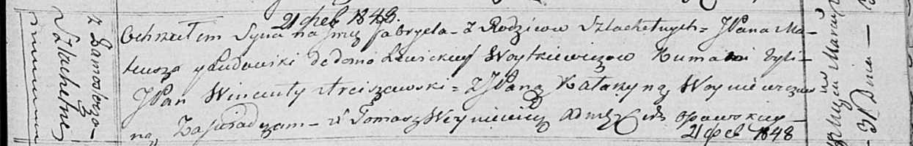

**Войткевич Габриэль Матеушев, шляхтич (Woytkiewicz Gabriel)**

31 марта 1818 г -- крещение (НИАБ 136-13-894, лист 98, №12/1818-р
(ориг)).

**НИАБ 136-13-894:** Лист 98. **Метрическая запись №12/1818-р (ориг).**

Осовская Покровская церковь. 31 марта 1818 года. Метрическая запись о
крещении.

Woytkiewicz Gabriel, JP -- сын родителей с деревни Замосточье, шляхтич.

Woytkiewicz Mateusz -- отец.

Woytkiewiczowa z Lewickich Ludowika -- мать.

Arciszewski Wincenty, JP -- кум, шляхтич.

Woyniewiczowa Katarzyna, JP -- кума, шляхтянка.

Woyniewicz Tomasz -- ксёндз.
