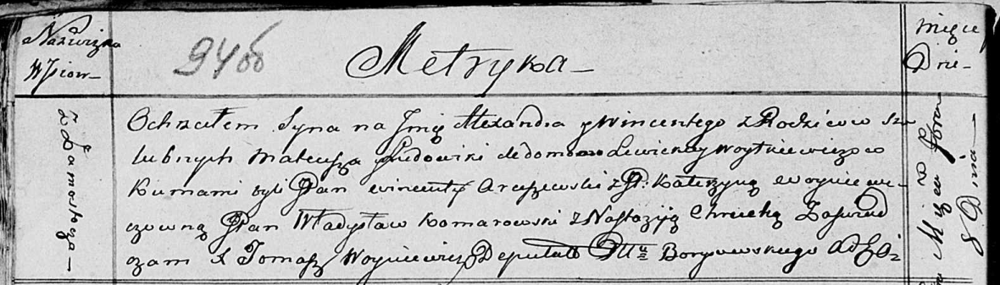

**Войткевич Матеуш, шляхтич (Woytkiewicz Mateusz)**

27 сентября 1814 г -- крещение сына Антония (НИАБ 136-13-894, лист 90об,
№54/1814-р (ориг)).

8 сентября 1816 г -- крещение сына Александра Винцентыя (НИАБ
136-13-894, лист 94об, №29/1816-р (ориг)).

31 марта 1818 г -- крещение сына Габриэля (НИАБ 136-13-894, лист 98,
№12/1818-р (ориг)).

7 декабря 1819 г -- крещение сына Томаша (НИАБ 136-13-894, лист 102,
№48/1819-р (ориг)).

**НИАБ 136-13-894:** Лист 90об. **Метрическая запись №54/1814-р
(ориг).**

Осовская Покровская церковь. 27 сентября 1814 года. Метрическая запись о
крещении.

Woytkiewicz Antoni, JP -- сын родителей с деревни Замосточье, шляхтич.

Woytkiewicz Mateusz, JP -- отец, шляхтич.

Woytkiewiczowa z Liewickich Eudokija, JP -- мать, шляхтянка.

Arciszewski Wincenty, JP -- кум, шляхтич.

K...cowna Franciszka, JP -- кума, шляхтянка.

Bujewicz Jan, JP -- ассистент, шляхтич.

Woyniewiczowna katerzyna, JP -- ассистентка, шляхтянка.

Woyniewicz Tomasz -- ксёндз.

**НИАБ 136-13-894:** Лист 94об. **Метрическая запись №29/1816-р
(ориг).**

Осовская Покровская церковь. 8 сентября 1816 года. Метрическая запись о
крещении.

Woytkiewicz Alexander Wincenty, JP -- сын родителей с деревни
Замосточье, шляхтич.

Woytkiewicz Mateusz, JP -- отец, шляхтич.

Woytkiewiczowa z Lewickich Ludowika, JP -- мать, шляхтянка.

Arciszewski Wincenty, JP -- кум, шляхтич.

Woyniewiczowna Katerzyna, JP -- кума, шляхтянка.

Komarowski Władysław, JP -- ассистент, шляхтич.

Chrucka Nastazija -- ассистентка.

Woyniewicz Tomasz -- ксёндз.

**НИАБ 136-13-894:** Лист 98. **Метрическая запись №12/1818-р (ориг).**

Осовская Покровская церковь. 31 марта 1818 года. Метрическая запись о
крещении.

Woytkiewicz Gabriel, JP -- сын родителей с деревни Замосточье, шляхтич.

Woytkiewicz Mateusz -- отец.

Woytkiewiczowa z Lewickich Ludowika -- мать.

Arciszewski Wincenty, JP -- кум, шляхтич.

Woyniewiczowa Katarzyna, JP -- кума, шляхтянка.

Woyniewicz Tomasz -- ксёндз.

**НИАБ 136-13-894:** Лист 102. **Метрическая запись №48/1819-р (ориг).**

Осовская Покровская церковь. 7 декабря 1819 года. Метрическая запись о
крещении.

Woytkiewicz Tomasz, JP -- сын родителей с деревни Замосточье, шляхтич.

Woytkiewicz Mateusz, JP -- отец, шляхтич.

Woytkiewiczowa z Lewickich Ludowika, JP -- мать, шляхтянка.

Jłgowski? Jan, WJP -- кум, шляхтич, хорунжий войска Польского.

Węckiewiczowna Waleryanna, WYP -- кума, шляхтянка, ... с Борисова.

Łukomski Bołtromiey, JP -- кум, шляхтич.

Arciszewska Justyna -- кума.

Woyniewicz Tomasz -- ксёндз.
