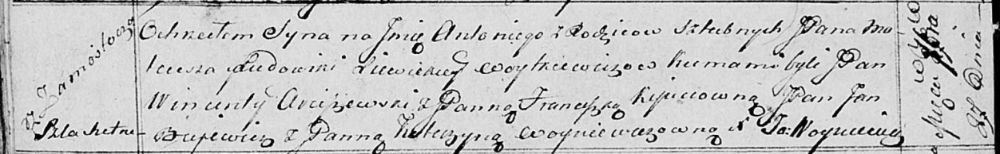

**Войткевич Томаш Матеушев, шляхтич (Woytkiewicz Tomasz)**

7 декабря 1819 г -- крещение (НИАБ 136-13-894, лист 102, №48/1819-р
(ориг)).

**НИАБ 136-13-894:** Лист 102. **Метрическая запись №48/1819-р (ориг).**

{width="6.496527777777778in"
height="2.714876421697288in"}

Осовская Покровская церковь. 7 декабря 1819 года. Метрическая запись о
крещении.

Woytkiewicz Tomasz, JP -- сын родителей с деревни Замосточье, шляхтич.

Woytkiewicz Mateusz, JP -- отец, шляхтич.

Woytkiewiczowa z Lewickich Ludowika, JP -- мать, шляхтянка.

Jłgowski? Jan, WJP -- кум, шляхтич, хорунжий войска Польского.

Węckiewiczowna Waleryanna, WYP -- кума, шляхтянка, ... с Борисова.

Łukomski Bołtromiey, JP -- кум, шляхтич.

Arciszewska Justyna -- кума.

Woyniewicz Tomasz -- ксёндз.
