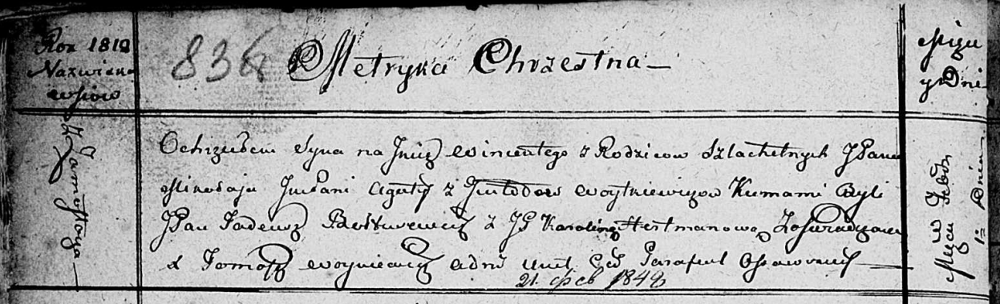

**Войткевич Винценты Миколаев (Woytkiewicz Wincenty)**

1 февраля 1812 г -- крещение (НИАБ 136-13-894, лист 83об, №8/1812-р
(ориг)).

**НИАБ 136-13-894:** Лист 83об. **Метрическая запись №8/1812-р (ориг).**

{width="6.496527777777778in"
height="1.980003280839895in"}

Осовская Покровская церковь. 1 февраля 1812 года. Метрическая запись о
крещении.

Woytkiewicz Wincenty, JP -- сын законных супругов, шляхтич, с деревни
Замосточье.

Woytkiewicz Mikolay, JP -- отец, шляхтич.

Woytkiewiczowa z Gintodow Agata, JP -- мать, шляхтянка.

Boltusewicz? Tadeusz, JP -- кум, шляхтич.

Hertmanowa Karolina, JP -- кума, шляхтянка.

Woyniewicz Tomasz -- ксёндз.
