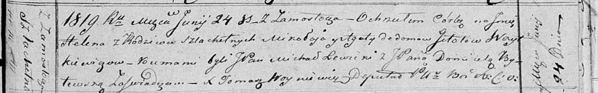

**Войткевич Елена Миколаева (Woytkiewiczowna Helena)**

24 июня 1819 г -- крещение (НИАБ 136-13-894, лист 101, №31/1819-р
(ориг)).

**НИАБ 136-13-894:** Лист 101. **Метрическая запись №31/1819-р (ориг).**

Осовская Покровская церковь. 24 июня 1819 года. Метрическая запись о
крещении.

Woytkiewiczowna Helena, JP -- дочь родителей с деревни Замосточье,
шляхтянка.

Woytkiewicz Mikołay, JP -- отец, шляхтич.

Woytkiewiczowa z Gitotow Agata, JP -- мать, шляхтянка.

Lewicki Michał, JP -- кум, шляхтич.

Bytewska Domicela, JP -- кума, шляхтянка.

Woyniewicz Tomasz -- ксёндз.
