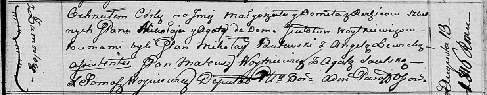

**Войткевич Малгожата Миколаева (Woytkiewiczowna Małgorzata Domeła)**

13 августа 1816 г -- крещение (НИАБ 136-13-894, лист 94, №21/1816-р
(ориг)).

**НИАБ 136-13-894:** Лист 94. **Метрическая запись №21/1816-р (ориг).**

{width="6.496527777777778in"
height="1.2799945319335082in"}

Осовская Покровская церковь. 13 августа 1816 года. Метрическая запись о
крещении.

Woytkiewiczowna Małgorzata Domeła, JP -- дочь родителей с деревни
Замосточье, шляхтянка.

Woytkiewicz Mikołay, JP -- отец, шляхтич.

Woytkiewiczowa z Gintdtow Agata, JP -- мать, шляхтянка.

Butewski Mikołay, JP -- кум, шляхтич.

Lewicka Angela -- кума.

Woytkiewicz Mateusz, JP -- ассистент, шляхтич.

Saulska Agata -- ассистентка.

Woyniewicz Tomasz -- ксёндз.
