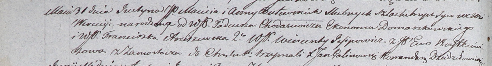

**Войткевич Деограта Михалова (Woytkiewiczowna Deograta Thecla)**

3 октября 1809 г -- крещение (НИАБ 937-4-32, лист 20, №27/1809-р).

**НИАБ 937-4-32:** Лист 20. **Метрическая запись №27/1809-р.**

{width="6.496527777777778in"
height="2.0277777777777777in"}

Дедиловичский костел Наисвятейшего Сердца Иисуса. 3 октября 1809 года.
Метрическая запись о крещении.

Woytkiewiczowna Deograta Thecla -- дочь шляхтичей с деревни Замосточье.

Woytkiewicz Michael -- отец.

Woytkiewiczowa Eva -- мать.

Buiewicz Michael -- крестный отец, шляхтич.

Arciszewska Franciszka -- крестная мать, шляхтянка.

Arciszewski Vincenti - ассистент, шляхтич.

Buiewiczowa Hedwiga - ассистентка, шляхтянка.

Miszkun Marcus -- ксёндз.
