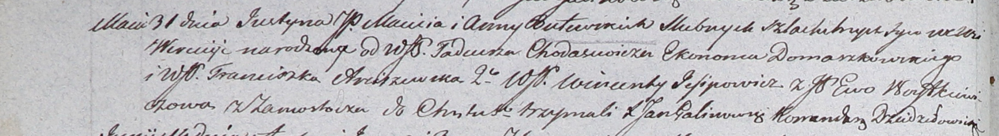

**Войткевич Ева (Woytkiewiczowa Ewa)**

2 января 1799 г -- крещение дочери Анастасии (НИАБ 1781-27-199, лист
125, №1/1799-р).

10 ноября 1802 г -- крещение сына Михала (НИАБ 937-4-32, лист 7об,
№35/1802-р).

31 мая 1803 г -- крестная мать Юстына, сына шляхтичей Мацея и Анны
Бутовских с деревни Веретей (НИАБ 937-4-32, лист 9об, №14/1803-р).

3 октября 1809 г -- крещение дочери Деограты Текли (НИАБ 937-4-32, лист
20, №27/1809-р).

**НИАБ 1781-27-199:** Лист 125. **Метрическая запись №1/1799-р.**

{width="6.496527777777778in"
height="0.6027777777777777in"}

Дедиловичский костел Наисвятейшего Сердца Иисуса. 2 января 1799 года.
Метрическая запись о крещении.

Woytkiewiczowna Anastasia -- дочь крестьян с деревни Замосточье.

Woytkiewicz Michael -- отец.

Woytkiewiczowa Ewa -- мать.

Razborski Gregor -- крестный отец.

Pietrowska Małania - крестная мать.

Linhart Hyacinthus -- ксёндз.

**НИАБ 937-4-32:** Лист 7об. **Метрическая запись №35/1802-р.**

{width="6.496527777777778in"
height="1.0069444444444444in"}

Дедиловичский костел Наисвятейшего Сердца Иисуса. 10 ноября 1802 года.
Метрическая запись о крещении.

Woykiewicz Michael -- сын вольных людей с деревни Замосточье.

Woykiewicz Michael -- отец.

Woykiewiczowa Eva -- мать.

Jsipowicz Vincentiusz -- крестный отец, с деревни Домашковичи.

Arciszewska Franciszka -- крестная мать, с деревни Осово.

Linhart Hyacinthus -- ксёндз.

**НИАБ 937-4-32:** Лист 9об. **Метрическая запись №14/1803-р.**

{width="6.496527777777778in"
height="0.8888888888888888in"}

Дедиловичский костел Наисвятейшего Сердца Иисуса. 31 мая 1803 года.
Метрическая запись о крещении.

Butewski Justyn -- сын шляхтичей с деревни Веретей.

Butewski Maciey -- отец.

Butewska Anna -- мать.

Chodasewicz Tadeusz -- крестный отец, шляхтич, эконом Домашковичский.

Arciszewska Franciszka -- крестная мать, шляхтянка.

Jesipowicz Wincenty - ассистент, шляхтич.

Woytkiewiczowa Ewa - ассистентка, шляхтянка, с деревни Замосточье.

Galinowski Joann -- ксёндз, комендант Дедиловичского костела.

**НИАБ 937-4-32:** Лист 20. **Метрическая запись №27/1809-р.**

{width="6.496527777777778in"
height="2.0277777777777777in"}

Дедиловичский костел Наисвятейшего Сердца Иисуса. 3 октября 1809 года.
Метрическая запись о крещении.

Woytkiewiczowna Deograta Thecla -- дочь шляхтичей с деревни Замосточье.

Woytkiewicz Michael -- отец.

Woytkiewiczowa Eva -- мать.

Buiewicz Michael -- крестный отец, шляхтич, с деревни Замосточье.

Arciszewska Franciszka -- крестная мать, шляхтянка, с деревни
Замосточье.

Arciszewski Vincenti - ассистент, шляхтич, с деревни Замосточье.

Buiewiczowa Hedwiga - ассистентка, шляхтянка, с деревни Замосточье.

Miszkun Marcus -- ксёндз.
