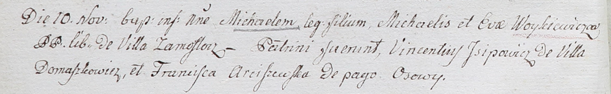

**Войткевич Михал Михалов (Woykiewicz Michael)**

10 ноября 1802 г -- крещение (НИАБ 937-4-32, лист 7об, №35/1802-р).

**НИАБ 937-4-32:** Лист 7об. **Метрическая запись №35/1802-р.**

Дедиловичский костел Наисвятейшего Сердца Иисуса. 10 ноября 1802 года.
Метрическая запись о крещении.

Woykiewicz Michael -- сын вольных людей с деревни Замосточье.

Woykiewicz Michael -- отец.

Woykiewiczowa Eva -- мать.

Jsipowicz Vincentiusz -- крестный отец, с деревни Домашковичи.

Arciszewska Franciszka -- крестная мать, с деревни Осово.

Linhart Hyacinthus -- ксёндз.
