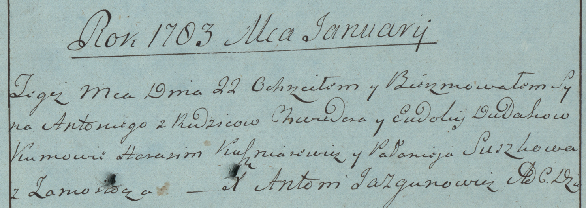

**Дудак Евдокия (Dudakowa Eudokija)**

22 января 1783 г -- крещение сына Антона (РГИА 823-2-18, лист 223,
№1/1783-р (коп)).

**РГИА 823-2-18:** Лист 223. **Метрическая запись №1/1783-р (коп).**

{width="6.496527777777778in"
height="2.3159722222222223in"}

Дедиловичская Покровская церковь. 22 января 1783 года. Метрическая
запись о крещении.

Dudak Antoni -- сын родителей с деревни Замосточье.

Dudak Chwiedor -- отец.

Dudakowa Eudokia -- мать.

Kuszniarewicz Harasim -- кум.

Suszkowa Pałanieja - кума.

Jazgunowicz Antoni -- ксёндз.
