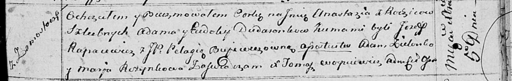

**Дударёнок Евдокия (Dudaronkowa Eudokija)**

5 декабря 1814 г -- крещение дочери Анастасии (НИАБ 136-13-894; лист 91,
№68/1814-р (ориг)).

**НИАБ 136-13-894:** Лист 91. **Метрическая запись №68/1814-р (ориг).**

Осовская Покровская церковь. 5 декабря 1814 года. Метрическая запись о
крещении.

Dudaronkowna Anastazija -- дочь родителей с деревни Замосточье.

Dudaronek Adam -- отец.

Dudaronkowa Eudokija -- мать.

Rapacewicz Jozef -- кум.

Bujewiczowna Pełagia, JP -- кума, шляхтянка.

Zielonka Adam -- ассистент.

Rozynkowa Marja -- ассистентка.

Woyniewicz Tomasz -- ксёндз.
