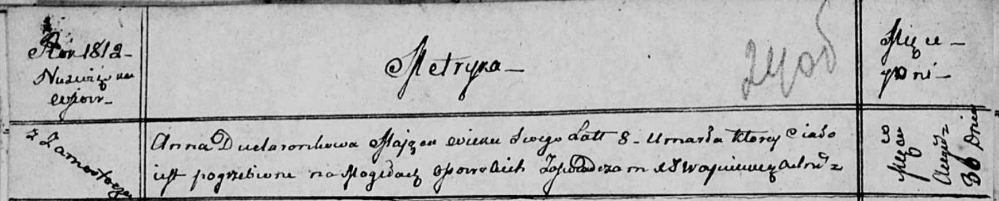

**Дударёнок Анна (Dudaronkowa Anna)**

30 августа 1812 г -- отпевание, умерла в возрасте 8 лет (родилась около
1804 г) (НИАБ 136-13-919, лист 24об, №16/1812 -у (ориг)).

**НИАБ 136-13-919:** Лист 24об. **Метрическая запись №16/1812-у
(ориг).**

{width="6.496527777777778in"
height="1.3076388888888888in"}

Осовская униатская церковь. 30 августа 1812 года. Метрическая запись об
отпевании.

Dudaronkowa Anna -- умерший, 8 лет, с деревни Замосточье, похоронена на
кладбище деревни Осово.

Woyniewicz Tomasz -- ксёндз.
