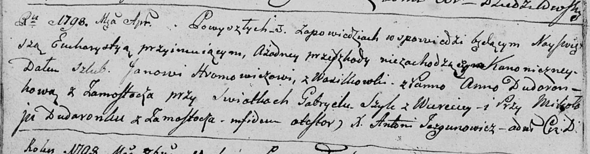

**Хромович (Дударёнок) Анна (Hromowiczowa (Dudaronkowa) Anna)**

Апрель 1798 г -- венчание с Яном Хромовичем с деревни Васильковка (НИАБ
136-13-920, лист 5об, №8/1798-б (ориг)).

**НИАБ 136-13-920:** Лист 5об. **Метрическая запись №8/1798-б (ориг).**

Дедиловичская Покровская церковь. Апреля 1798 года. Метрическая запись о
венчании.

Hromowicz Jan -- жених, деревня Васильковка.

Dudaronkowa Anna -- невеста, деревня Замосточье.

Szyło Gabriel -- свидетель, деревня Веретей.

Dudaronek Mikołay -- свидетель, деревня Замосточье.

Jazgunowicz Antoni -- ксёндз.
