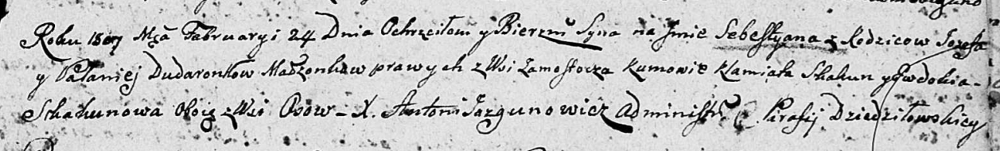

**Дударёнок Иосиф (Dudaronek Jozef)**

5 ноября 1794 г -- венчание с Палюхой Церах (НИАБ 136-13-920, лист 1об,
№11/1794-б (ориг)).

16 декабря 1806 г -- крещение сына Данилы Себестыана (НИАБ 136-13-894,
лист 61об, №52/1806-р (ориг)).

24 февраля 1807 г -- крещение сына Себестыана (НИАБ 136-13-894; лист
61об, №52/1806-р (ориг), лист 62, №52доп/1806-р (ориг)).

5 сентября 1810 г -- крещение дочери Тересы (НИАБ 136-13-894, лист 78об,
№36/1810-р (ориг)).

10 августа 1813 г -- крещение дочери Ружы (НИАБ 136-13-894, лист 87,
№27/1813-р (ориг)).

6 мая 1817 г -- крещение дочери Анастасии (НИАБ 136-13-894, лист 96об,
№31/1817-р (ориг)).

**НИАБ 136-13-920:** Лист 1об. **Метрическая запись №11/1794-б (ориг).**

{width="6.496527777777778in"
height="1.4784645669291339in"}

Дедиловичская Покровская церковь. 5 ноября 1794 года. Метрическая запись
о венчании.

Dudaronek Jozef -- жених, деревня Замосточье.

Cierachowna Palucha -- невеста, девка.

Busła Wasil -- свидетель.

Szyło Stefan -- свидетель.

Jazgunowicz Antoni -- ксёндз.

**НИАБ 136-13-894:** Лист 61об. **Метрическая запись №52/1806-р
(ориг).**

{width="6.496527777777778in"
height="1.092253937007874in"}

Дедиловичская Покровская церковь. 16 декабря 1806 года. Метрическая
запись о крещении.

Dudaronek Daniło Sebestyan -- сын родителей с деревни Замосточье.

Dudaronek Jozef -- отец.

Dudaronkowa Pałanieja -- мать.

Skakun Klamiata -- кум, с деревни Осовo.

Skakunowa Ewdokia -- кума, с деревни Осовo.

Jazgunowicz Antoni -- ксёндз.

**НИАБ 136-13-894:** Лист 62. **Метрическая запись №52доп/1806-р
(ориг).**

{width="6.496527777777778in"
height="0.9822900262467191in"}

Дедиловичская Покровская церковь. 24 февраля 1807 года. Метрическая
запись о крещении.

Dudaronek Sebestyan -- сын родителей с деревни Замосточье.

Dudaronek Jozef -- отец.

Dudaronkowa Pałanieja -- мать.

Skakun Klamiata -- кум, с деревни Осовo.

Skakunowa Ewdokija -- кума, с деревни Осовo.

Jazgunowicz Antoni -- ксёндз.

**НИАБ 136-13-894:** Лист 78об. **Метрическая запись №36/1810-р
(ориг).**

{width="6.496527777777778in"
height="0.8803740157480315in"}

Осовская Покровская церковь. 5 сентября 1810 года. Метрическая запись о
крещении.

Dudaronkowna Teresa -- дочь родителей с деревни Замосточье.

Dudaronek Jozef -- отец.

Dudaronkowa Polonia -- мать.

Skakun Klemens -- кум.

Czaplajowa Ewdokija -- кума.

Woyniewicz Tomasz -- ксёндз.

**НИАБ 136-13-894:** Лист 87. **Метрическая запись №27/1813-р (ориг).**

{width="6.496527777777778in"
height="0.75834208223972in"}

Осовская Покровская церковь. 10 августа 1813 года. Метрическая запись о
крещении.

Dudaronkowna Róża -- дочь родителей с деревни Замосточье.

Dudaronek Jozef -- отец.

Dudaronkowna Połonija -- мать.

Daraszewicz Teodor -- кум.

Czaplajowa Darja -- кума.

Woyniewicz Tomasz -- ксёндз.

**НИАБ 136-13-894:** Лист 96об. **Метрическая запись №31/1817-р
(ориг).**

{width="6.496527777777778in"
height="1.4630435258092738in"}

Осовская Покровская церковь. 6 мая 1817 года. Метрическая запись о
крещении.

Dudaronkowna Anastazija -- дочь родителей с деревни Замосточье.

Dudaronek Jozef -- отец.

Dudaronkowa Połonija -- мать.

Skakun Klemes -- кум.

Skakunowa Eudokija -- кума.

Woyniewicz Tomasz -- ксёндз.
