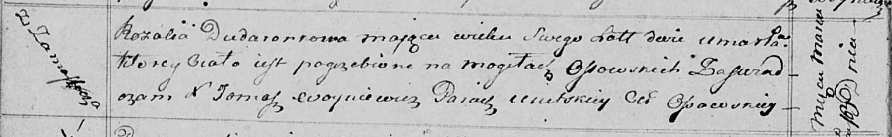

**Дударёнок Ружа (Розалия) Иосифова (Dudaronkowna Róża, Rozalia)**

10 августа 1813 г -- крещение (НИАБ 136-13-894, лист 87, №27/1813-р
(ориг)).

13 марта 1815 г -- отпевание, умерла в возрасте 2 лет (НИАБ 136-13-919,
лист 28об, №5/1815-у (ориг)).

**НИАБ 136-13-894:** Лист 87. **Метрическая запись №27/1813-р (ориг).**

Осовская Покровская церковь. 10 августа 1813 года. Метрическая запись о
крещении.

Dudaronkowna Róża -- дочь родителей с деревни Замосточье.

Dudaronek Jozef -- отец.

Dudaronkowna Połonija -- мать.

Daraszewicz Teodor -- кум.

Czaplajowa Darja -- кума.

Woyniewicz Tomasz -- ксёндз.

**НИАБ 136-13-919:** Лист 28об. **Метрическая запись №5/1815-у (ориг).**

Осовская униатская церковь. 13 марта 1815 года. Метрическая запись об
отпевании.

Dudaronkowa Rozalia -- умершая, 2 года, с деревни Замосточье, похоронена
на кладбище деревни Осово.

Woyniewicz Tomasz -- ксёндз.
