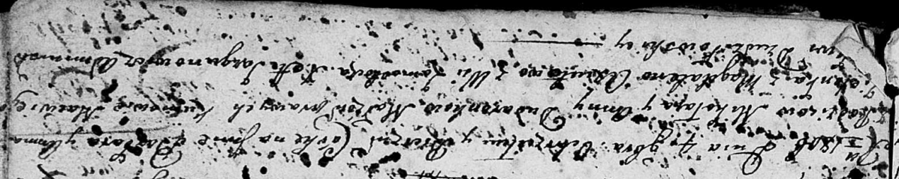

**Дударёнок Миколай (Dudaronek Mikołay)**

Апрель 1798 г -- свидетель венчания Яна Хромовича с деревни Васильковка
с Анной Дударёнок с деревни Замосточье (НИАБ 136-13-920, лист 5об,
№8/1798-б (ориг)).

3 октября 1804 г -- крещение сына Филипа Сергея (НИАБ 136-13-894, лист
55, №45/1804-р (ориг)).

4 ноября 1806 г -- крещение дочери Варвары Анны (НИАБ 136-13-894, лист
60об, №36/1806-р (ориг), лист 61 №48/1806-р (ориг)).

**НИАБ 136-13-920:** Лист 5об. **Метрическая запись №8/1798-б (ориг).**

{width="6.496527777777778in"
height="1.7024136045494314in"}

Дедиловичская Покровская церковь. Апреля 1798 года. Метрическая запись о
венчании.

Hromowicz Jan -- жених, деревня Васильковка.

Dudaronkowa Anna -- невеста, деревня Замосточье.

Szyło Gabriel -- свидетель, деревня Веретей.

Dudaronek Mikołay -- свидетель, деревня Замосточье.

Jazgunowicz Antoni -- ксёндз.

**НИАБ 136-13-894:** Лист 55. **Метрическая запись №45/1804-р (ориг).**

{width="6.496527777777778in"
height="0.8099704724409449in"}

Дедиловичская Покровская церковь. 3 октября 1804 года. Метрическая
запись о крещении.

Dudaronek Filip Serhey -- сын родителей с деревни Замосточье.

Dudaronek Mikołay -- отец.

Dudaronkowa Anna -- мать.

Zielonka Maciey -- кум.

Axiutowa Magdalena -- кума.

Jazgunowicz Antoni -- ксёндз.

**НИАБ 136-13-894:** Лист 60об. **Метрическая запись №36/1806-р
(ориг).**

{width="6.496527777777778in"
height="1.2994400699912512in"}

Дедиловичская Покровская церковь. 4 ноября 1806 года. Метрическая запись
о крещении.

Dudaronkowna Barbara Anna -- дочь родителей с деревни Замосточье.

Dudaronek Mikołay -- отец.

Dudaronkowa Anna -- мать.

Zielonka Macwiey -- кум.

Axiutowa Magdalena -- кума.

Jazgunowicz Antoni -- ксёндз.

**НИАБ 136-13-894:** Лист 61. **Метрическая запись №38а/1806-р (ориг).**
(см.тж. Лист 60об №36)

{width="6.496527777777778in"
height="1.2954166666666667in"}

Дедиловичская Покровская церковь. 4 ноября 1806 года. Метрическая запись
о крещении.

Dudaronkowna Barbara Anna -- дочь родителей с деревни Замосточье.

Dudaronek Mikołay -- отец.

Dudaronkowa Anna -- мать.

Zielonka Macwiey -- кум.

Axiutowa Magdalena -- кума.

Jazgunowicz Antoni -- ксёндз.
