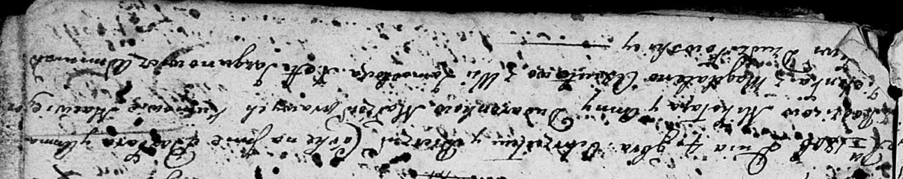

**Дударёнок Филип Миколаев (Dudaronek Filip Serhey)**

3 октября 1804 г -- крещение (НИАБ 136-13-894, лист 55, №45/1804-р
(ориг)).

**НИАБ 136-13-894:** Лист 55. **Метрическая запись №45/1804-р (ориг).**

{width="6.496527777777778in"
height="0.8099704724409449in"}

Дедиловичская Покровская церковь. 3 октября 1804 года. Метрическая
запись о крещении.

Dudaronek Filip Serhey -- сын родителей с деревни Замосточье.

Dudaronek Mikołay -- отец.

Dudaronkowa Anna -- мать.

Zielonka Maciey -- кум.

Axiutowa Magdalena -- кума.

Jazgunowicz Antoni -- ксёндз.
