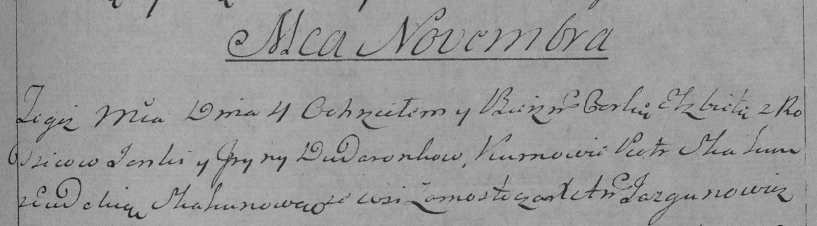

**Дударёнок Елисавета Янкова (Dudaronkowna Elżbieta)**

4 ноября 1794 г -- крещение дочери Елисаветы (НИАБ 136-13-894, лист 23,
№51/1794-р (ориг)), (РГИА 823-2-18, лист 251, №37/1794-р (коп)).

**НИАБ 136-13-894:** Лист 23. **Метрическая запись №51/1794-р (ориг).**

Дедиловичская Покровская церковь. 4 ноября 1794 года. Метрическая запись
о крещении.

Dudaronkowa Elżbieta -- дочь родителей с деревни Замосточье.

Dudaronok Janka -- отец.

Dudaronkowa Jryna -- мать.

Skakun Piotr - кум.

Skakunowa Ewdokija - кума.

Jazgunowicz Antoni -- ксёндз.

**РГИА 823-2-18:** Лист 251. **Метрическая запись №37/1794-р (коп).**

Дедиловичская Покровская церковь. 4 ноября 1794 года. Метрическая запись
о крещении.

Dudaronkowna Elżbieta -- дочь родителей с деревни Замосточье.

Dudaronek Janka -- отец.

Dudaronkowa Jryna -- мать.

Skakun Piotr -- кум.

Skakunowa Ewdokia -- кума.

Jazgunowicz Antoni -- ксёндз.
