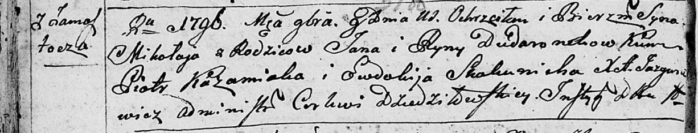
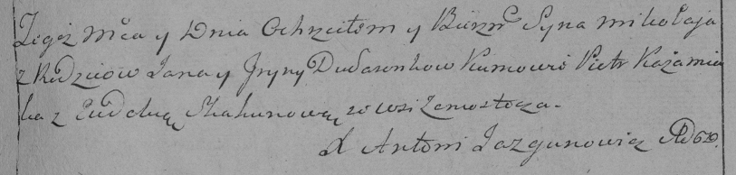

**Дударёнок Миколай Янков (Dudaronek Mikołay)**

8 ноября 1796 г -- крещение сына Миколая (НИАБ 136-13-894, лист 31об,
№97/1796-р (ориг)), (РГИА 823-2-18, лист 258, №60/1796-р (коп)).

Лист 31-об. **Метрическая запись №97/1796-р (ориг).**

Дедиловичская Покровская церковь. 8 ноября 1796 года. Метрическая запись
о крещении.

Dudaronek Mikołay -- сын родителей с деревни Замосточье.

Dudaronek Jan -- отец.

Dudaronkowa Ryna -- мать.

Każamiaka Piotr - кум.

Skakunicha Ewdokija - кума.

Jazgunowicz Antoni -- ксёндз.

**РГИА 823-2-18:** Лист 258. **Метрическая запись №60/1796-р (коп).**

Дедиловичская Покровская церковь. \[8\] ноября 1796 года. Метрическая
запись о крещении.

Dudaronek Mikołay -- сын родителей с деревни Замосточье.

Dudaronek Jan -- отец.

Dudaronkowa Jryna -- мать.

Każamiaka Piotr -- кум.

Skakunowa Eudokia -- кума.

Jazgunowicz Antoni -- ксёндз.
