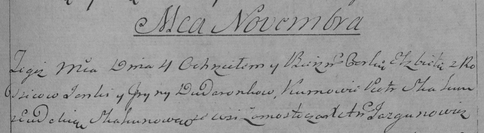

**Дударёнок Янка (Dudaronek Janka, Jan)**

8 ноября 1792 г -- венчание с Ярыной Авдюхович с деревни Замосточье
(НИАБ 136-13-894, лист 71об, №20/1792-б (ориг)).

4 ноября 1794 г -- крещение дочери Елисаветы (НИАБ 136-13-894, лист 23,
№51/1794-р (ориг)), (РГИА 823-2-18, лист 251, №37/1794-р (коп)).

8 ноября 1796 г -- крещение сына Миколая (НИАБ 136-13-894, лист 31об,
№97/1796-р (ориг)), (РГИА 823-2-18, лист 258, №60/1796-р (коп)).

Лист 71об. **Метрическая запись №20/1792-б (ориг).**

{width="6.496527777777778in"
height="2.2508869203849518in"}

Дедиловичская Покровская церковь. 8 ноября 1792 года. Метрическая запись
о венчании.

Dudaronek Jan -- жених, с деревни Замосточье.

Audziuchowiczowna Jaryna -- невеста, с деревни Замосточье.

Woynicz Wasil -- свидетель.

Audziuchowicz Wasil -- свидетель, с деревни Замосточье.

Jazgunowicz Antoni -- ксёндз.

**НИАБ 136-13-894:** Лист 23. **Метрическая запись №51/1794-р (ориг).**

{width="6.496527777777778in"
height="1.106334208223972in"}

Дедиловичская Покровская церковь. 4 ноября 1794 года. Метрическая запись
о крещении.

Dudaronkowa Elżbieta -- дочь родителей с деревни Замосточье.

Dudaronok Janka -- отец.

Dudaronkowa Jryna -- мать.

Skakun Piotr - кум.

Skakunowa Ewdokija - кума.

Jazgunowicz Antoni -- ксёндз.

**РГИА 823-2-18:** Лист 251. **Метрическая запись №37/1794-р (коп).**

{width="6.496527777777778in"
height="1.7972222222222223in"}

Дедиловичская Покровская церковь. 4 ноября 1794 года. Метрическая запись
о крещении.

Dudaronkowna Elżbieta -- дочь родителей с деревни Замосточье.

Dudaronek Janka -- отец.

Dudaronkowa Jryna -- мать.

Skakun Piotr -- кум.

Skakunowa Ewdokia -- кума.

Jazgunowicz Antoni -- ксёндз.

Лист 31-об. **Метрическая запись №97/1796-р (ориг).**

{width="6.496527777777778in"
height="1.2451290463692037in"}

Дедиловичская Покровская церковь. 8 ноября 1796 года. Метрическая запись
о крещении.

Dudaronek Mikołay -- сын родителей с деревни Замосточье.

Dudaronek Jan -- отец.

Dudaronkowa Ryna -- мать.

Każamiaka Piotr - кум.

Skakunicha Ewdokija - кума.

Jazgunowicz Antoni -- ксёндз.

**РГИА 823-2-18:** Лист 258. **Метрическая запись №60/1796-р (коп).**

{width="6.496527777777778in"
height="1.55in"}

Дедиловичская Покровская церковь. \[8\] ноября 1796 года. Метрическая
запись о крещении.

Dudaronek Mikołay -- сын родителей с деревни Замосточье.

Dudaronek Jan -- отец.

Dudaronkowa Jryna -- мать.

Każamiaka Piotr -- кум.

Skakunowa Eudokia -- кума.

Jazgunowicz Antoni -- ксёндз.
