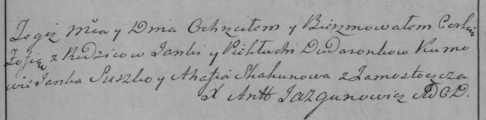

**Дударёнок Пехлуха? (Dudaronkowa Piechłucha?)**

21 сентября 1785 г -- крещение дочери Зофии (РГИА 823-2-18, лист 230,
№25/1785-р (коп)).

**РГИА 823-2-18:** Лист 230. **Метрическая запись №24/1785-р (коп).**

{width="6.496527777777778in"
height="1.6041666666666667in"}

Дедиловичская Покровская церковь. 21 сентября 1785 года. Метрическая
запись о крещении.

Dudaronkowna Zofia -- дочь родителей с деревни Замосточье.

Dudaronek Janka -- отец.

Dudaronkowa Piehłucha? -- мать.

Suszko Janka -- кум.

Skakunowa Ahafia - кума.

Jazgunowicz Antoni -- ксёндз.
