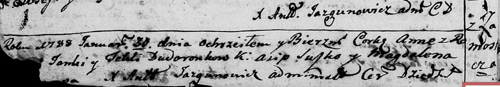
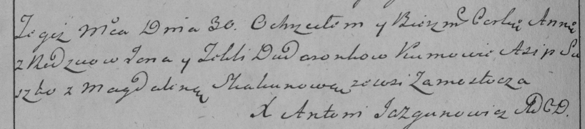

**Дударёнок Янка (Dudaronek Janka)**

30 января 1788 г -- крещение дочери Анны (НИАБ 136-13-894, лист 3об,
№12/1788-р (ориг)), (РГИА 823-2-18, лист 235об, №3/1788-р (коп)).

**НИАБ 136-13-894:** Лист 3об. **Метрическая запись №12/1788-р (ориг).**

Дедиловичская Покровская церковь. 30 января 1788 года. Метрическая
запись о крещении.

Dudaronkowa Anna -- дочь родителей с деревни Замосточье.

Dudaronek Janka -- отец.

Dudaronkowa Tekla -- мать.

Suszko Asip - кум.

? Magdalena - кума.

Jazgunowicz Antoniusz -- ксёндз.

**РГИА 823-2-18:** Лист 235об. **Метрическая запись №3/1788-р (коп).**

Дедиловичская Покровская церковь. 30 января 1788 года. Метрическая
запись о крещении.

Dudaronkowna Anna -- дочь родителей с деревни Замосточье.

Dudaronek Jan -- отец.

Dudaronkowa Tekla -- мать.

Suszko Asip -- кум.

Skakunowa Magdalena - кума.

Jazgunowicz Antoni -- ксёндз.
