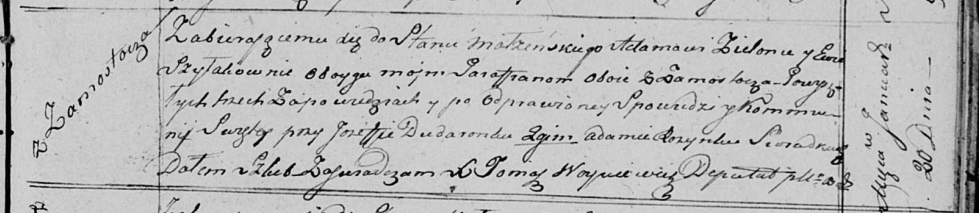
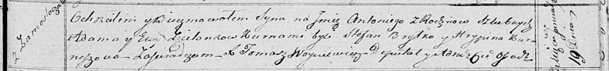
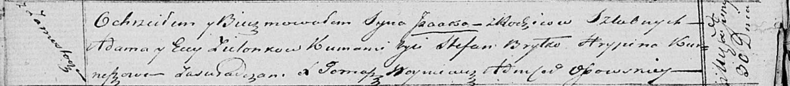

**Зелёнка Адам (Zielonko Adam)**

20 января 1818 г -- венчание с Евой Шилак с деревни Замосточье (НИАБ
136-13-920, лист 25, №2/1818-б (ориг)).

19 января 1819 г -- крещение сына Антония (НИАБ 136-13-894, лист 100,
№3/1819-р (ориг)).

30 июня 1821 г -- крещение сына Исаака (НИАБ 136-13-894, лист 106об,
№29/1821-р (ориг)).

**НИАБ 136-13-920:** Лист 25. **Метрическая запись №2/1818-б (ориг).**

Осовская Покровская церковь. 20 января 1818 года. Запись о венчании.

Zielonka Adam -- жених, парафии Осовской, с деревни Замосточье.

Szyłakowna Ewa -- невеста, парафии Осовской, с деревни Замосточье.

Dudaronek Jozef -- свидетель.

Rozynka Adam -- свидетель.

Woyniewicz Tomasz -- ксёндз.

**НИАБ 136-13-894:** Лист 100. **Метрическая запись №3/1819-р (ориг).**

Осовская Покровская церковь. 19 января 1819 года. Метрическая запись о
крещении.

Zielonko Antoni -- сын родителей с деревни Замосточье.

Zielonko Adam -- отец.

Zielonkowa Ewa -- мать.

Brytko Stefan -- кум.

Kurneszowa Hrypina -- кума.

Woyniewicz Tomasz -- ксёндз.

**НИАБ 136-13-894:** Лист 106об. **Метрическая запись №29/1821-р
(ориг).**

Осовская Покровская церковь. 30 июня 1821 года. Метрическая запись о
крещении.

Zielonko Jsaak -- сын родителей с деревни Замосточье.

Zielonko Adam -- отец.

Zielonkowa Ewa -- мать.

Brytko Stefan -- кум.

Kurneszowa Hrypina -- кума.

Woyniewicz Tomasz -- ксёндз.
