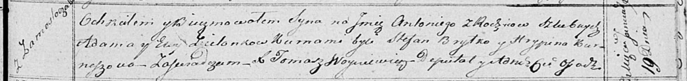

**Зелёнка Антоний Адамов (Zielonko Antoni)**

19 января 1819 г -- крещение (НИАБ 136-13-894, лист 100, №3/1819-р
(ориг)).

**НИАБ 136-13-894:** Лист 100. **Метрическая запись №3/1819-р (ориг).**

Осовская Покровская церковь. 19 января 1819 года. Метрическая запись о
крещении.

Zielonko Antoni -- сын родителей с деревни Замосточье.

Zielonko Adam -- отец.

Zielonkowa Ewa -- мать.

Brytko Stefan -- кум.

Kurneszowa Hrypina -- кума.

Woyniewicz Tomasz -- ксёндз.
