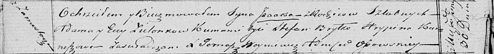

**Зелёнка Исаак Адамов (Zielonko Isaak)**

30 июня 1821 г -- крещение (НИАБ 136-13-894, лист 106об, №29/1821-р
(ориг)).

**НИАБ 136-13-894:** Лист 106об. **Метрическая запись №29/1821-р
(ориг).**

Осовская Покровская церковь. 30 июня 1821 года. Метрическая запись о
крещении.

Zielonko Jsaak -- сын родителей с деревни Замосточье.

Zielonko Adam -- отец.

Zielonkowa Ewa -- мать.

Brytko Stefan -- кум.

Kurneszowa Hrypina -- кума.

Woyniewicz Tomasz -- ксёндз.
