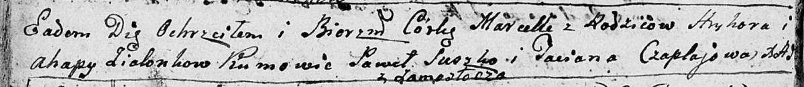
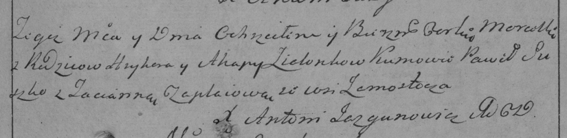

**Зелёнка Марцелла Грыгорова (Zialonkowna Marcella)**

24 августа 1796 г -- крещение (НИАБ 136-13-894, лист 30об, №76/1796-р
(ориг)), (РГИА 823-2-18, лист 257, №46/1796-р (коп)).

**НИАБ 136-13-894:** Лист 30-об. **Метрическая запись №76/1796-р
(ориг).**

Дедиловичская Покровская церковь. 24 августа 1796 года. Метрическая
запись о крещении.

Zialonkowna Marcella -- дочь родителей с деревни Замосточье.

Zialonka Hryhor -- отец.

Zialonkowa Ahapa -- мать.

Suszko Pawel - кум.

Czaplajowa Taciana - кума.

Jazgunowicz Antoni -- ксёндз.

**РГИА 823-2-18:** Лист 257. **Метрическая запись №46/1796-р (коп).**

Дедиловичская Покровская церковь. 24 августа 1796 года. Метрическая
запись о крещении.

Zielonkowna Marcella -- дочь родителей с деревни Замосточье.

Zielonka Hryhor -- отец.

Zielonkowa Ahapa -- мать.

Suszko Paweł -- кум.

Czaplajowa Tacianna -- кума.

Jazgunowicz Antoni -- ксёндз.
