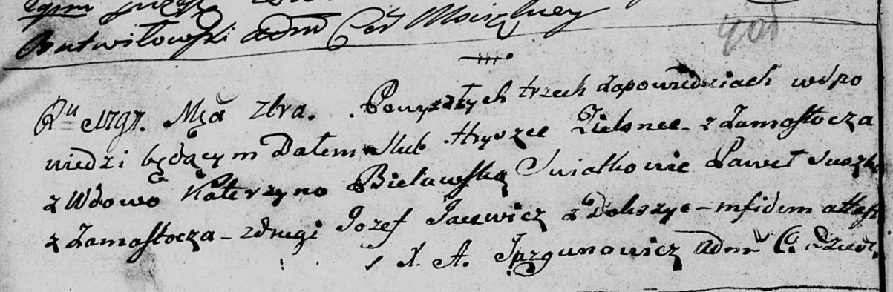

**Зелёнка Андрей Грышков (Zialonka Andrzey)**

23 августа 1798 г -- крещение (НИАБ 136-13-894, лист 36об, №37/1798-р
(ориг)), (РГИА 823-2-18, лист 265, №37/1798-р (коп)).

**НИАБ 136-13-894:** Лист 36об. **Метрическая запись №37/1798-р
(ориг).**

{width="6.496527777777778in"
height="0.9641874453193351in"}

Дедиловичская Покровская церковь. 23 августа 1798 года. Метрическая
запись о крещении.

Zialonka Andrzey -- сын родителей с деревни Замосточье.

Zialonka Hryszka -- отец.

Zialonkowa Katerzyna -- мать.

Suszko Paweł - кум.

Skakunowa Ewdokija - кума.

Jazgunowicz Antoni -- ксёндз.

**РГИА 823-2-18:** Лист 265. **Метрическая запись №37/1798-р (коп).**

{width="6.496527777777778in"
height="1.288888888888889in"}

Дедиловичская Покровская церковь. 23 августа 1798 года. Метрическая
запись о крещении.

Zielonka Andrzey -- сын родителей с деревни \[Замосточье\].

Zielonka Hryszka -- отец.

Zielonkowa Katerzyna -- мать.

Szuszko Paweł -- кум.

Skakunowa Eudokia -- кума.

Jazgunowicz Antoni -- ксёндз.
