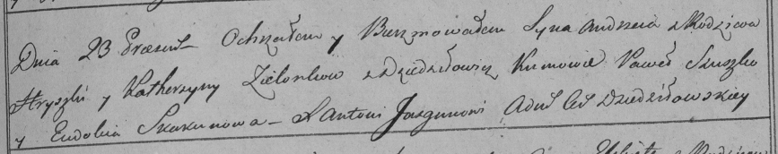

**Зелёнка Грышка (Zialonka Hryszka, Hryhor)**

Сентябрь 1797 г -- венчание с вдовой Катерыной Белявской (НИАБ
136-13-920, лист 4об, №7/1797-б (ориг)).

23 августа 1798 г -- крещение сына Андрея (НИАБ 136-13-894, лист 36об,
№37/1798-р (ориг)), (РГИА 823-2-18, лист 265, №37/1798-р (коп)).

25 ноября 1800 г -- крещение дочери Зофии Анны (НИАБ 136-13-894, лист
42об, №33/1800-р (ориг), НИАБ 136-13-949, лист 104, №36/1800-р (коп)).

8 апреля 1803 г -- крещение дочери Марыи Паракседы (НИАБ 136-13-894,
лист 50, №15/1803-р (ориг)).

**НИАБ 136-13-920:** Лист 4об. **Метрическая запись №7/1797-б (ориг).**

{width="6.496527777777778in"
height="2.1275142169728785in"}

Дедиловичская Покровская церковь. Сентября 1797 года. Метрическая запись
о венчании.

Zielonka Hryszka -- жених, с деревни Замосточье.

Bielawska Katerzyna -- невеста, вдова.

Suszko Paweł -- свидетель, с деревни Замосточье.

Jacewicz Jozef -- свидетель, с местечка Докшицы.

Jazgunowicz Antoni -- ксёндз.

**НИАБ 136-13-894:** Лист 36об. **Метрическая запись №37/1798-р
(ориг).**

{width="6.496527777777778in"
height="0.9641874453193351in"}

Дедиловичская Покровская церковь. 23 августа 1798 года. Метрическая
запись о крещении.

Zialonka Andrzey -- сын родителей с деревни Замосточье.

Zialonka Hryszka -- отец.

Zialonkowa Katerzyna -- мать.

Suszko Paweł - кум.

Skakunowa Ewdokija - кума.

Jazgunowicz Antoni -- ксёндз.

**РГИА 823-2-18:** Лист 265. **Метрическая запись №37/1798-р (коп).**

{width="6.496527777777778in"
height="1.288888888888889in"}

Дедиловичская Покровская церковь. 23 августа 1798 года. Метрическая
запись о крещении.

Zielonka Andrzey -- сын родителей с деревни \[Замосточье\].

Zielonka Hryszka -- отец.

Zielonkowa Katerzyna -- мать.

Szuszko Paweł -- кум.

Skakunowa Eudokia -- кума.

Jazgunowicz Antoni -- ксёндз.

**НИАБ 136-13-894:** Лист 42об. **Метрическая запись №33/1800-р
(ориг).**

{width="6.496527777777778in"
height="1.5656299212598426in"}

Дедиловичская Покровская церковь. 25 ноября 1800 года. Метрическая
запись о крещении.

Zielonkowna Zofia Anna -- дочь родителей с деревни Замосточье.

Zielonka Hryszka -- отец.

Zielonkowa Katerzyna -- отец.

Suszko Paweł -- кум, с деревни Осовo.

Czaplajowa Taciana -- кума, с деревни Осовo.

Jazgunowicz Antoni -- ксёндз.

**НИАБ 136-13-949:** Лист 104. **Метрическая запись №36/1800-р (коп).**

(См. тж.: НИАБ 136-13-894, лист 42, №33/1800-р (ориг))

{width="6.496527777777778in"
height="1.33125in"}

Дедиловичская Покровская церковь. 25 ноября 1800 года. Метрическая
запись о крещении.

Zielonkowna Zofia Anna -- сын родителей с деревни Замосточье.

Zielonko Hryszka -- отец.

Zielonkowa Katerzyna -- мать.

Suszko Paweł -- кум, с деревни \[Осовo\].

Czapłajowa Taciana - кума, с деревни \[Осовo\].

Jazgunowicz Antoni -- ксёндз.

**НИАБ 136-13-894:** Лист 50. **Метрическая запись №15/1803-р (ориг).**

{width="6.496527777777778in"
height="1.7480074365704288in"}

Дедиловичская Покровская церковь. 8 апреля 1803 года. Метрическая запись
о крещении.

Zielonkowna Marya Paraxeda -- дочь родителей с деревни Замосточье.

Zielonka Hryhor -- отец.

Zielonkowa Katerzyna -- мать.

Suszko Paweł -- кум, с деревни Замосточье.

Suszkowa Taciana -- кума, с деревни Замосточье.

Jazgunowicz Antoni -- ксёндз.
