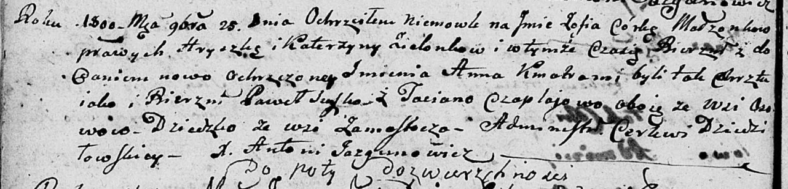
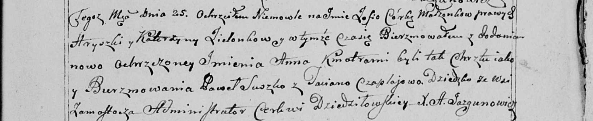

**Зелёнка Зофия Грышкова (Zialonkowna Zofia Anna)**

25 ноября 1800 г -- крещение (НИАБ 136-13-894, лист 42об, №33/1800-р
(ориг), НИАБ 136-13-949, лист 104, №36/1800-р (коп)).

**НИАБ 136-13-894:** Лист 42об. **Метрическая запись №33/1800-р
(ориг).**

Дедиловичская Покровская церковь. 25 ноября 1800 года. Метрическая
запись о крещении.

Zielonkowna Zofia Anna -- дочь родителей с деревни Замосточье.

Zielonka Hryszka -- отец.

Zielonkowa Katerzyna -- отец.

Suszko Paweł -- кум, с деревни Осовo.

Czaplajowa Taciana -- кума, с деревни Осовo.

Jazgunowicz Antoni -- ксёндз.

**НИАБ 136-13-949:** Лист 104. **Метрическая запись №36/1800-р (коп).**

(См. тж.: НИАБ 136-13-894, лист 42, №33/1800-р (ориг))

Дедиловичская Покровская церковь. 25 ноября 1800 года. Метрическая
запись о крещении.

Zielonkowna Zofia Anna -- сын родителей с деревни Замосточье.

Zielonko Hryszka -- отец.

Zielonkowa Katerzyna -- мать.

Suszko Paweł -- кум, с деревни \[Осовo\].

Czapłajowa Taciana - кума, с деревни \[Осовo\].

Jazgunowicz Antoni -- ксёндз.
