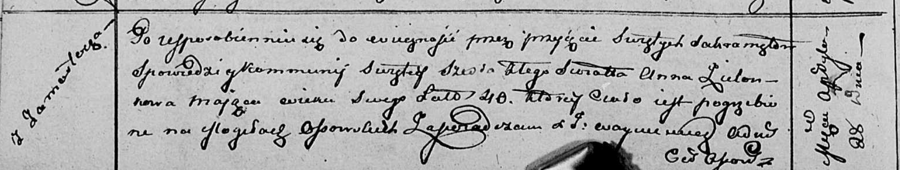

**Зелёнка Захар (Zielеnko Zacharyasz)**

1 июля 1818 г -- отпевание, умер в возрасте 5 лет (родился около 1813 г)
(НИАБ 136-13-919, лист 32, №12/1818-у (ориг)).

**НИАБ 136-13-919:** Лист 32. **Метрическая запись №12/1818-у (ориг).**

{width="6.496527777777778in"
height="0.7118055555555556in"}

Осовская униатская церковь. 1 июля 1818 года. Метрическая запись об
отпевании.

Zielonko Zacharyasz -- умерший, 5 лет, с деревни Замосточье, похоронен
на кладбище деревни Осово.

Woyniewicz Tomasz -- ксёндз.
