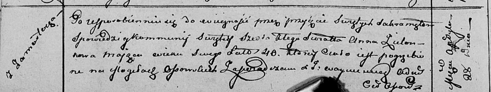

**Сушко (в предыдущем браке Зелёнко) София (Suszkowa (Zielonkowa)
Zofija)**

8 марта 1821 г -- венчание с вдовцом Романом Сушко с деревни Горелое
(НИАБ 136-13-920, лист 28, №4/1821-б (ориг)).

**НИАБ 136-13-920:** Лист 28. **Метрическая запись №4/1821-б (ориг).**

{width="6.496527777777778in"
height="1.4462806211723536in"}

Осовская Покровская церковь. 8 марта 1821 года. Запись о венчании.

Suszko Roman -- жених, вдовец, парафии Дедиловичской католической, с
деревни Горелое.

Zielonkowa Zofija -- невеста, вдова, парафии Осовской, с деревни
Замосточье.

Suszko Stefan -- свидетель.

Dudaronek Jozef -- свидетель.

Woyniewicz Tomasz -- ксёндз.
