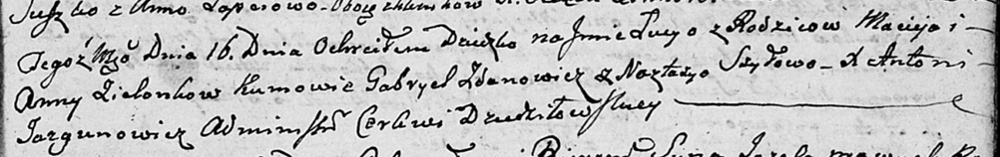
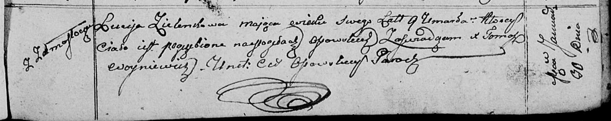

**Зелёнка Люция Мацвеева (Zialonkowna Lucyja)**

16 декабря 1802 г -- крещение (НИАБ 136-13-894, лист 49, №49/1802-р
(ориг)).

30 января 1811 г -- отпевание, умерла в возрасте 9 лет (НИАБ 136-13-919,
лист 22, №4/1811-у (ориг)).

**НИАБ 136-13-894:** Лист 49. **Метрическая запись №49/1802-р (ориг).**

Дедиловичская Покровская церковь. 16 декабря 1802 года. Метрическая
запись о крещении.

Zielonkowna Lucyja -- дочь родителей с \[деревни Замосточье\].

Zielonka Maciey -- отец.

Zielonkowa Anna -- мать.

Żdanowicz Gabriel -- кум.

Szyłowa Nastacyja -- кума.

Jazgunowicz Antoni -- ксёндз.

**НИАБ 136-13-919:** Лист 22. **Метрическая запись №4/1811-у (ориг).**

Осовская униатская церковь. 30 января 1811 года. Метрическая запись об
отпевании.

Zielonkowa Luceja -- умершая, 9 лет, с деревни Замосточье, похоронена на
кладбище деревни Осово.

Woyniewicz Tomasz -- ксёндз.
