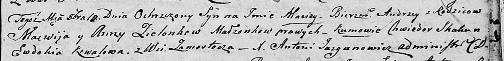

**Зелёнка Мацей Мацвеев (Zialonka Maciey Andrzey)**

10 октября 1805 г -- крещение (НИАБ 136-13-894, лист 58, №42/1805-р
(ориг)).

**НИАБ 136-13-894:** Лист 58. **Метрическая запись №42/1805-р (ориг).**

Дедиловичская Покровская церковь. 10 октября 1805 года. Метрическая
запись о крещении.

Zielonka Maciey Andrzey -- сын родителей с деревни Замосточье.

Zielonka Macwiey -- отец.

Zielonkowa Anna -- мать.

Skakun Chwiedor -- кум.

Kowalowa Ewdokija -- кума.

Jazgunowicz Antoni -- ксёндз.
