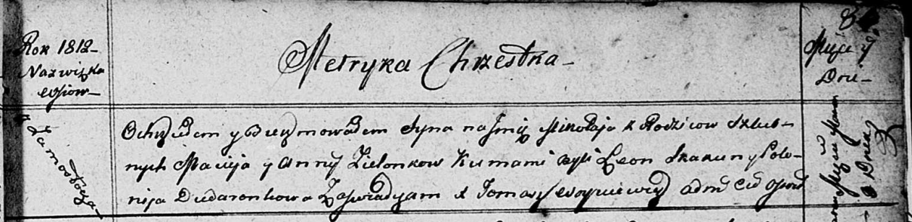

**Зелёнка Миколай Мацвеев (Zielonko Mikołay)**

9 марта 1812 г -- крещение (НИАБ 136-13-894, лист 84, №16/1812-р
(ориг)).

**НИАБ 136-13-894:** Лист 84. **Метрическая запись №16/1812-р (ориг).**

{width="6.496527777777778in"
height="1.5877569991251093in"}

Осовская Покровская церковь. 9 марта 1812 года. Метрическая запись о
крещении.

Zielonko Mikolay -- сын родителей с деревни Замосточье.

Zielonko Maciey -- отец.

Zielonkowa Anna -- мать.

Skakun Leon -- кум.

Dudaronkowa Polonija -- кума.

Woyniewicz Tomasz -- ксёндз.
