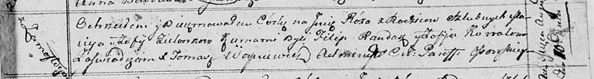

**Зелёнка Габриэль Мацеев (Zielonka Gabriel)**

4 апреля 1815 г -- крещение (НИАБ 136-13-894, лист 92, №21/1815-р
(ориг)).

**НИАБ 136-13-894:** Лист 92. **Метрическая запись №21/1815-р (ориг).**

{width="6.496527777777778in"
height="1.1546106736657917in"}

Осовская Покровская церковь. 4 апреля 1815 года. Метрическая запись о
крещении.

Zielonko Gabryel -- сын родителей с деревни Замосточье.

Zielonko Maciey -- отец.

Zielonkowa Zofija -- мать.

Randak Filip -- кум.

Kowałowa Anna -- кума.

Woyniewicz Tomasz -- ксёндз.
