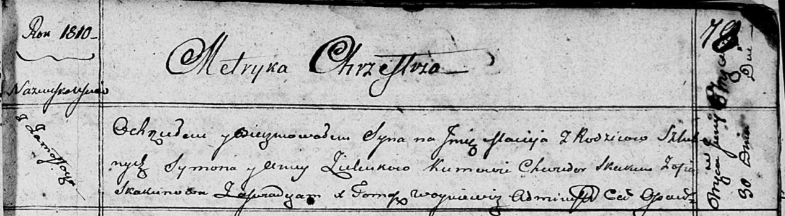

**Зелёнка Сымон (Zielеnko Symon)**

30 июня 1810 г -- крещение сына Мацея (НИАБ 136-13-894, лист 78,
№24/1810-р (ориг)).

**НИАБ 136-13-894:** Лист 78. **Метрическая запись №24/1810-р (ориг).**

Осовская Покровская церковь. 30 июня 1810 года. Метрическая запись о
крещении.

Zielenko Maciey -- сын родителей с деревни Замосточье.

Zielenko Symon -- отец.

Zielenkowa Anna -- мать.

Skakun Chwiedor -- кум.

Skakunowa Zofia -- кума.

Woyniewicz Tomasz -- ксёндз.
