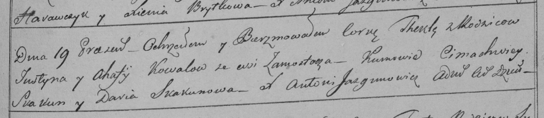

**Коваль Юстын (Kowal Justyn)**

29 января 1798 г -- крещение дочери Текли (НИАБ 136-13-894, лист 37,
№44/1798-р (ориг)), (РГИА 823-2-18, лист 266, №45/1798-р (коп)).

**НИАБ 136-13-894:** Лист 37. **Метрическая запись №44/1798-р (ориг).**

{width="6.496527777777778in"
height="1.0486701662292213in"}

Дедиловичская Покровская церковь. 29 января 1798 года. Метрическая
запись о крещении.

Kowalowna Tekla -- сын родителей с деревни Замосточье.

Kawal Justyn -- отец.

Kowalowa Ahafija -- мать.

Skakun Cimachwiey- кум.

Skakunowa Darya - кума.

Jazgunowicz Antoni -- ксёндз.

**РГИА 823-2-18:** Лист 266. **Метрическая запись №45/1798-р (коп).**

{width="6.496527777777778in"
height="1.41875in"}

Дедиловичская Покровская церковь. \[29 января\] 1798 года. Метрическая
запись о крещении.

Kowalowna Thekla -- дочь родителей с деревни Замосточье.

Kowal Justyn -- отец.

Kowalowa Ahafija -- мать.

Skakun Cimachwiey -- кум.

Skakunowa Daria -- кума.

Jazgunowicz Antoni -- ксёндз.
