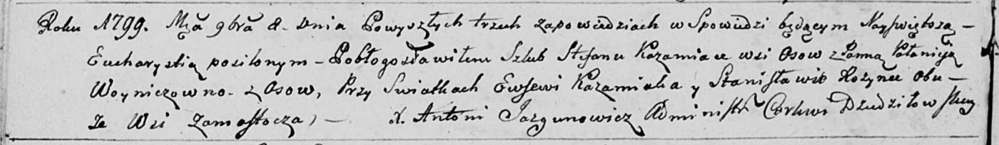

**Кожемяко Евсей (Każamiaka Ewsewi)**

8 ноября 1799 г -- свидетель венчания Стефана Кожемяки с деревни Осово с
Полонеей Войнич с деревни Осово (НИАБ 136-13-920, лист 6об, №6/1799-б
(ориг)).

**НИАБ 136-13-920:** Лист 6об. **Метрическая запись №6/1799-б (ориг).**

Дедиловичская Покровская церковь. 8 ноября 1799 года. Метрическая запись
о венчании.

Każamiaka Stefan -- жених, деревня Осовo.

Woyniczowna Połonieja -- невеста, деревня Осовo.

Każamiaka Ewsewi -- свидетель, деревня Замосточье.

Rozynka Stanisław -- свидетель, деревня Замосточье.

Jazgunowicz Antoni -- ксёндз.
