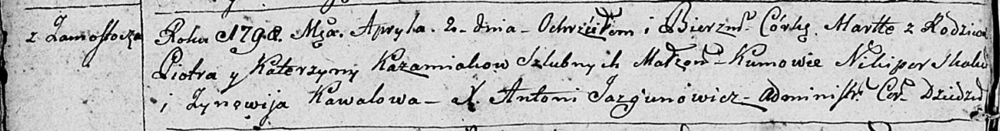
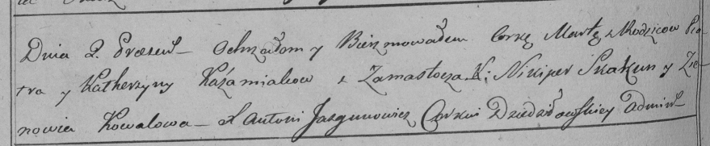
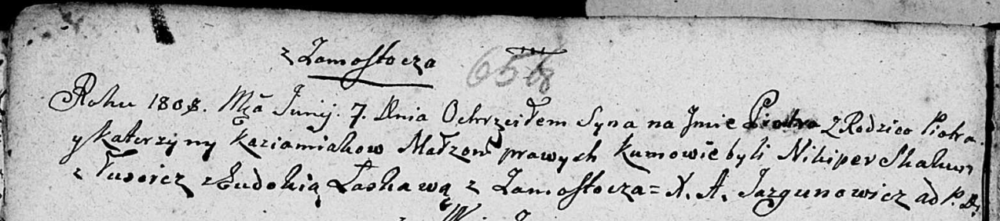
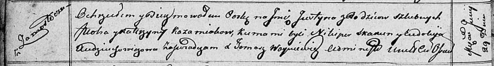

**Кожемяка Пётр (Każamiaka Piotr)**

2 апреля 1798 г -- крещение дочери Марты (НИАБ 136-13-894, лист 35об,
№13/1798-р (ориг)), (РГИА 823-2-18, лист 262об, №13/1798-р (коп)).

7 июня 1808 г -- крещение сына Петра (НИАБ 136-13-894, лист 65об,
№22/1808-р (ориг)).

29 июня 1812 г -- крещение дочери Юстыны (НИАБ 136-13-894, лист 84об,
№32/1812-р (ориг)).

**НИАБ 136-13-894:** Лист 35-об. **Метрическая запись №13.**

Дедиловичская Покровская церковь. 2 апреля 1798 года. Метрическая запись
о крещении.

Każamiakowna Marta -- дочь родителей с деревни Замосточье.

Każamiaka Piotr -- отец.

Każamiakowa Katerzyna -- мать.

Skakun Nikiper - кум.

Kawalowa Zynowija - кума.

Jazgunowicz Antoni -- ксёндз.

**РГИА 823-2-18:** Лист 262об. **Метрическая запись №13/1798-р (коп).**

Дедиловичская Покровская церковь. 2 апреля 1798 года. Метрическая запись
о крещении.

Każamiakowna Marta -- дочь родителей с деревни Замосточье.

Każamiaka Piotr -- отец.

Każamiakowa Katerzyna -- мать.

Skakun Nikiper -- кум.

Kowalowa Zienowia -- кума.

Jazgunowicz Antoni -- ксёндз.

**НИАБ 136-13-894:** Лист 65об. **Метрическая запись №22/1808-р
(ориг).**

Дедиловичская Покровская церковь. 7 июня 1808 года. Метрическая запись о
крещении.

Każamiaka Piotr -- сын родителей с деревни Замосточье.

Każamiaka Piotr -- отец.

Każamiakowa Katerzyna -- мать.

Skakun Nikiper -- кум, с деревни Лустичи.

Łaskawa? Ewdokija -- кума, с деревни Замосточье.

Jazgunowicz Antoni -- ксёндз.

**НИАБ 136-13-894:** Лист 84об. **Метрическая запись №32/1812-р
(ориг).**

Осовская Покровская церковь. 29 июня 1812 года. Метрическая запись о
крещении.

Każamiakowna Justyna -- дочь родителей с деревни Замосточье.

Każamiaka Piotr -- отец.

Każamiakowa Katerzyna -- мать.

Skakun Nikiper -- кум.

Audziuchowiczowa Eudokija -- кума.

Woyniewicz Tomasz -- ксёндз.
