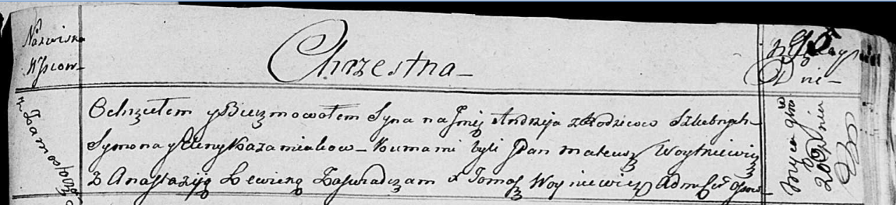

**Кожемяка Андрей Сымонов (Każamiaka Andrzey)**

20 ноября 1816 г -- крещение (НИАБ 136-13-894, лист 95, №40/1816-р
(ориг)).

**НИАБ 136-13-894:** Лист 95. **Метрическая запись №40/1816-р (ориг).**

{width="6.496527777777778in"
height="1.4925448381452318in"}

Осовская униатская церковь. 20 ноября 1816 года. Метрическая запись о
крещении.

Każamiaka Andrzey -- сын родителей с деревни Замосточье.

Każamiaka Symon -- отец.

Każamiakowa Elena -- мать.

Woytkiewicz Mateusz, JP -- кум, шляхтич.

Lewicka Anastazija -- кума.

Woyniewicz Tomasz -- ксёндз.
