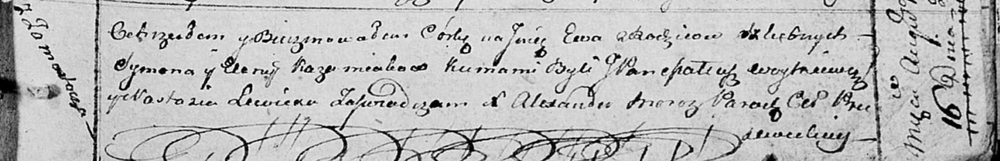

**Кожемяка Ева Сымонова (Każamiakowna Ewa)**

16 августа 1814 г -- крещение (НИАБ 136-13-894, лист 90, №49/1814-р
(ориг)).

**НИАБ 136-13-894:** Лист 90. **Метрическая запись №49/1814-р (ориг).**

Осовская Покровская церковь. 16 августа 1814 года. Метрическая запись о
крещении.

Każamiakowna Ewa -- дочь родителей с деревни Замосточье.

Każamiaka Symon -- отец.

Każamiakowa Elena -- мать.

Woytkiewicz Mateucz, JP -- кум, шляхтич.

Lewicka Nastazia -- кума.

Woyniewicz Tomasz -- ксёндз.
