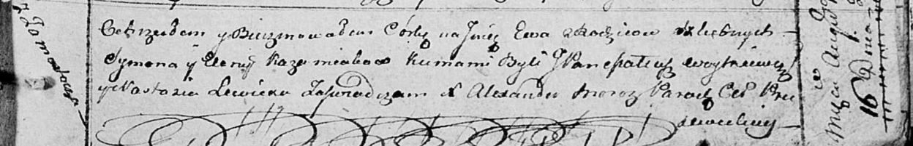

**Кожемяка Сымон (Każamiaka Symon)**

9 ноября 1813 г -- венчание с девкой Еленой Войнич с деревни Осово (НИАБ
136-13-920, лист 20об, №24/1813-б (ориг)).

16 августа 1814 г -- крещение дочери Евы (НИАБ 136-13-894, лист 90,
№49/1814-р (ориг)).

20 ноября 1816 г -- крещение сына Андрея (НИАБ 136-13-894, лист 95,
№40/1816-р (ориг)).

**НИАБ 136-13-920:** Лист 20об. **Метрическая запись №24/1813-б
(ориг).**

Осовская Покровская церковь. 9 ноября 1813 года. Запись о венчании.

Każamiaka Symon -- жених, вдовец, парафии Осовской, с деревни
Замосточье.

Woyniczowna Elena -- невеста, девка, парафии Осовской, с деревни Осово.

Brykun Jozef -- свидетель.

Woynicz Grzegorz -- свидетель.

Woyniewicz Tomasz -- ксёндз.

**НИАБ 136-13-894:** Лист 90. **Метрическая запись №49/1814-р (ориг).**

Осовская Покровская церковь. 16 августа 1814 года. Метрическая запись о
крещении.

Każamiakowna Ewa -- дочь родителей с деревни Замосточье.

Każamiaka Symon -- отец.

Każamiakowa Elena -- мать.

Woytkiewicz Mateucz, JP -- кум, шляхтич.

Lewicka Nastazia -- кума.

Woyniewicz Tomasz -- ксёндз.

**НИАБ 136-13-894:** Лист 95. **Метрическая запись №40/1816-р (ориг).**

Осовская униатская церковь. 20 ноября 1816 года. Метрическая запись о
крещении.

Każamiaka Andrzey -- сын родителей с деревни Замосточье.

Każamiaka Symon -- отец.

Każamiakowa Elena -- мать.

Woytkiewicz Mateusz, JP -- кум, шляхтич.

Lewicka Anastazija -- кума.

Woyniewicz Tomasz -- ксёндз.
