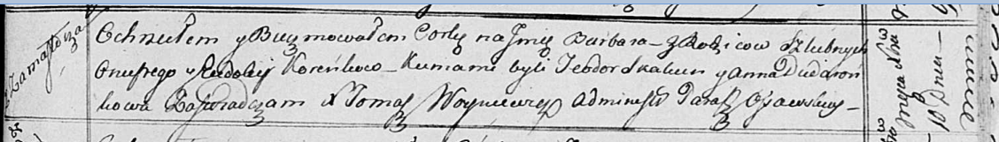

**Коренько Варвара Онуфрыева (Koreńkowna Barbara)**

10 декабря 1816 г -- крещение (НИАБ 136-13-894, лист 95, №43/1816-р
(ориг)).

**НИАБ 136-13-894:** Лист 95. **Метрическая запись №43/1816-р (ориг).**

{width="6.496527777777778in"
height="0.9273086176727909in"}

Осовская униатская церковь. 10 декабря 1816 года. Метрическая запись о
крещении.

Koreńkowna Barbara -- дочь родителей с деревни Замосточье.

Koreńko Onufry -- отец.

Koreńkowa Eudokija -- мать.

Skakun Teodor -- кум.

Dudaronkowa Anna -- кума.

Woyniewicz Tomasz -- ксёндз.
