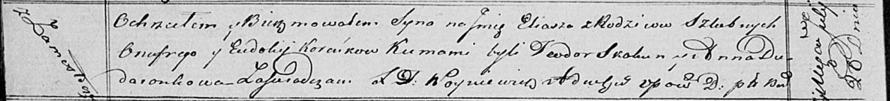

**Коренько Илья Онуфрыев (Koreńko Eliasz)**

20 июля 1820 г -- крещение (НИАБ 136-13-894, лист 104об, №24/1820-р
(ориг)).

**НИАБ 136-13-894:** Лист 104об. **Метрическая запись №24/1820-р
(ориг).**

Осовская Покровская церковь. 20 июля 1820 года. Метрическая запись о
крещении.

Koreńko Eliasz -- сын родителей с деревни Замосточье.

Koreńko Onufry -- отец.

Koreńkowa Eudokija -- мать.

Skakun Teodor -- кум.

Dudaronkowa Anna -- кума.

Woyniewicz Tomasz -- ксёндз.
